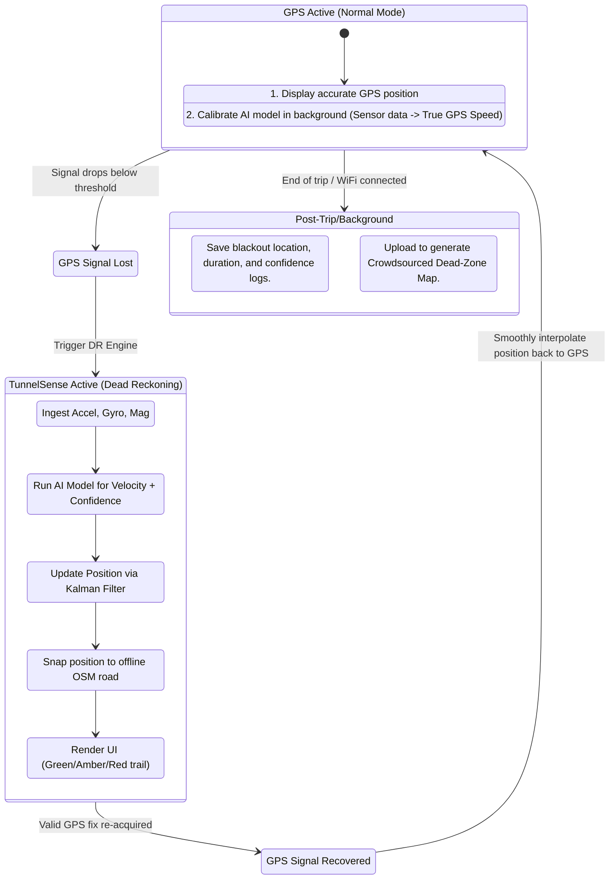

# TunnelSense: System Architecture and Product Strategy

## 1. How is this different from previous/standard Dead Reckoning?

Traditional dead reckoning (DR) systems simply take the last known speed and heading, or use basic physics (integrating accelerometer data) to guess where you are. They fail quickly, especially on two-wheelers, due to extreme vibration, phone mount rattling, and sensor noise.

**TunnelSense Innovations:**
1. **AI-Driven Velocity & Confidence:** Instead of raw physics equations, an on-device AI model interprets the *pattern* of vibrations and movements to estimate speed. Crucially, it outputs a **Confidence Score** (how sure the AI is about the speed).
2. **Transparent Uncertainty UI:** Traditional DR pretends it knows exactly where you are until it fails. TunnelSense uses a color-coded trail (Green/Amber/Red) to honestly communicate to the rider how much they can trust the current position marker.
3. **Smart Map Matching:** It doesn't just guess a coordinate; it snaps the guessed trajectory to actual offline road geometry (OSM), severely limiting drift.
4. **Smooth Handoff:** When GPS returns, traditional apps "teleport" the user, causing missed turns. TunnelSense smoothly interpolates the position back to the true GPS coordinate.
5. **Crowdsourced Intelligence:** It maps the dead-zones for future predictive behavior.

---

## 2. The Essentials (MVP Core) & Future Ideas

### Core Essentials (Must-Haves)
- **Sensor Ingestion Engine:** Capturing high-frequency data from Accelerometer, Gyroscope, and Magnetometer.
- **On-Device AI Model:** A lightweight neural network (e.g., TensorFlow Lite) trained to map phone sensor noise to forward velocity and confidence.
- **Kalman Filter:** The math engine that fuses the AI speed estimate, the compass heading, and the last GPS point.
- **Offline Map Snapping:** A local OpenStreetMap (OSM) spatial index to constrain the Kalman filter's output to valid roads.
- **Dynamic UI:** The map interface that handles the Green/Amber/Red trail rendering.

### Advanced Ideas (Next Phases)
- **Predictive Dead-Zone Alerts:** "Approaching GPS blind spot in 100m. Routing locked."
- **Community Dead-Zone Map:** Aggregate blackout data across all users to map city infrastructure weaknesses.
- **Mount-Agnostic Calibration:** Auto-detecting how the phone is mounted (portrait, landscape, tilted) and adjusting sensor readings automatically.

---

## 3. Web App (PWA) vs. Native App

You mentioned a "browser-based Progressive Web App (PWA)". Here is the breakdown of that decision:

### Progressive Web App (PWA)
**Pros:** Zero installation friction, instant updates, easy to share via a link, cross-platform out of the box.
**Cons:** Mobile browsers often restrict background sensor access (if the screen turns off, sensors stop). Browsers may cap sensor sampling rates (e.g., 60Hz instead of 100Hz+), and offline map storage quotas can be limited.

### Native App (React Native / Flutter / Kotlin / Swift)
**Pros:** Unrestricted access to background sensors, high-frequency polling, direct access to device neural engines (NPU) for faster AI inference, large offline storage for maps.
**Cons:** Requires app store approval, harder to distribute initially.

**Recommendation:**
*Start with a React Native or Flutter app.* While a PWA is great for standard apps, a navigation system requiring constant, high-frequency, reliable sensor access (even when the app goes to the background for a moment) usually hits a wall in mobile browsers. If you must use a PWA for distribution reasons, ensure the screen is forced awake (Wake Lock API) and test browser sensor rate limits immediately.

---

## 4. What Should Be in the App?

**For the Rider (Production UI):**
1. **The Map View:** 3D tilted or 2D top-down view focused on the route.
2. **TunnelSense Status Bar:** "GPS Active" vs. "TunnelSense Active (Estimating)".
3. **The Confidence Trail:** The actual path drawn in Green, Amber, or Red.
4. **Turn-by-Turn Card:** Big, readable text for the next instruction (e.g., "In 50m, Turn Left").
5. **Speed & ETA Display.**

**For the Developers (Debug Mode / Hidden Panel):**
1. **Raw Sensor Readouts:** Live graphs of X,Y,Z acceleration and gyro.
2. **AI Inference Metrics:** Current estimated velocity (m/s) and Confidence % output.
3. **Kalman Filter Variance:** To debug how fast the circle of uncertainty is growing.
4. **Data Logger:** A button to record a session to a CSV file for retraining the AI model.

---

## 5. The Full Technical Workflow

### Step-by-Step Breakdown:
1. **Calibration Phase (GPS ON):** While GPS is working, the app silently records sensor vibrations and matches them to the *known* GPS speed. This constantly fine-tunes the baseline for the specific bike and phone mount.
2. **The Drop (GPS OFF):** GPS accuracy drops (e.g., Accuracy > 20 meters or signal lost). The system instantly switches to TunnelSense.
3. **The Engine (TunnelSense ON):**
   - **Sensors:** Poll at ~50-100Hz.
   - **AI:** Infers that the current vibration pattern means the bike is moving at 30km/h with 85% confidence.
   - **Kalman Filter:** Takes the last known heading from the compass, the 30km/h speed, and projects the new latitude/longitude.
   - **Map Matching:** Looks at the offline map, realizes the projected coordinate is slightly off the road, and snaps it to the center of the lane.
   - **UI:** The trail turns Green. As seconds pass, if vibrations get weird (e.g., hitting a pothole), AI confidence drops to 40%. The trail turns Amber.
4. **The Recovery (GPS Returns):** The rider exits the tunnel. GPS gives a fix 10 meters ahead of the TunnelSense dot. Instead of jumping, the app smoothly glides the dot to the true location over 2 seconds.
5. **The Brain (Post-Trip):** The app logs: *"Lost GPS at (Lat, Lon) for 45 seconds."* This data is sent to your servers to build the city-wide dead-zone map.
