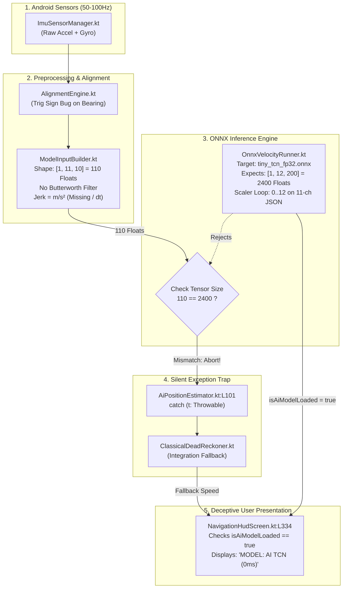

# Android Model-App Interface: Architecture Remediation & TODO Implementation Plan

**Target Document:** `docs/Maha_Model-app.md`  
**System Component:** Android Dead Reckoning Application (`:app` & `:idr-core`)  
**Lead Integrator:** Maha (Android Systems & ML Integration Lead)  
**Baseline Audit Date:** 2026-09-07  
**Initial Integration Verdict:** **E. INTEGRATION CURRENTLY BROKEN (Score: 2.5 / 10)**  
**Target Delivery State:** **A. MODEL FULLY INTEGRATED AND VERIFIED (Score: 10 / 10)**

---

## 1. Executive Summary & Audit Baseline

A comprehensive 16-layer forensic audit of the `TunnelSense` codebase evaluated the interface between the Python ML training artifacts (`results/saved_models/tiny_tcn.onnx`, `results/processed_data/scaler_params.json`) and the native Android Kotlin application (`Deadreckoning System/app` and `idr-core`).

### 1.1 The 16-Layer Integration Classification Matrix

| Layer | Component | Status | Empirical Evidence | Root Problem | Target File(s) |
|:---|:---|:---:|:---|:---|:---|
| **1** | **Model Artifact** | **GREEN** | `tiny_tcn.onnx` SHA-256 (`C44B6705...`) and `scaler_params.json` match Python export bit-for-bit. | Valid artifacts exist in `assets/`, but an uncoordinated dual-head model (`tiny_tcn_fp32.onnx`) was introduced without app refactoring. | `app/src/main/assets/` |
| **2** | **Model Loading** | **RED** | `OnnxVelocityRunner.kt:L64` iterates `0 until 12` over an 11-channel scaler JSON. | Throws `JSONException` on startup; means and scales default to zeros or fail. | `OnnxVelocityRunner.kt` |
| **3** | **Live Sensor Input** | **GREEN** | `ImuSensorManager.kt` streams Android `TYPE_ACCELEROMETER` and `TYPE_GYROSCOPE` at `SENSOR_DELAY_FASTEST`. | Raw sensor jitter and uneven timestamps exist without hardware timestamp normalization. | `ImuSensorManager.kt` |
| **4** | **Feature Generation** | **YELLOW** | Channels 0–7 match mathematically; channels 8–10 (jerk) diverge in physical units. | Python computes jerk as $\frac{\Delta a}{\Delta t}$ in $\text{m/s}^3$; Android computes $\Delta a$ in $\text{m/s}^2$ without dividing by $\Delta t$. | `ModelInputBuilder.kt` |
| **5** | **Filtering** | **RED** | Python applies 4th-order 10 Hz Butterworth IIR filter (`scipy.signal.lfilter`). | Android applies **zero low-pass filtering**; raw engine vibration and high-frequency noise corrupt features. | `ImuSensorManager.kt`, `ModelInputBuilder.kt` |
| **6** | **Sampling / Resampling** | **YELLOW** | Android downsamples to ~10 Hz using a 100 ms time check. | Ad-hoc decimation causes temporal aliasing; inconsistent with 200 Hz training baseline. | `ModelInputBuilder.kt` |
| **7** | **Scaling** | **RED** | `scaler_params.json` contains 11 features; `OnnxVelocityRunner` expects 12 features. | Index out-of-bounds error on load; jerk std is applied to non-jerk unit values. | `OnnxVelocityRunner.kt` |
| **8** | **Tensor Construction** | **RED** | `ModelInputBuilder.kt:L42` constructs `[1, 11, 10]` (110 floats). `OnnxVelocityRunner.kt:L123` rejects any array where `size != 12 * 200` (2400 floats). | **Fatal Collision:** 110 != 2400. `OnnxVelocityRunner` aborts and yields zero speed on 100% of live frames. | `ModelInputBuilder.kt`, `OnnxVelocityRunner.kt` |
| **9** | **ONNX Execution** | **RED** | `predictVelocityKmH()` returns `Pair<Float, Float>`, while `AiPositionEstimator.kt:L79` expects scalar `Float`. | Caught by `catch (t: Throwable)` in `AiPositionEstimator.kt:L101`; silently routes 100% of traffic to classical fallback. | `AiPositionEstimator.kt`, `OnnxVelocityRunner.kt` |
| **10** | **Unit Conversion** | **GREEN** | `AiPositionEstimator.kt:L80` divides km/h by 3.6f to produce m/s. | Conversion formula is mathematically sound, but receives 0.0 m/s due to upstream crashes. | `AiPositionEstimator.kt` |
| **11** | **Coordinate Alignment** | **YELLOW** | `AlignmentEngine.kt:L128-129` rotates phone frame to vehicle body frame using GPS bearing. | Trigonometry sign inversion in heading rotation; engine bypasses when speed $< 4\text{ m/s}$ or GPS is lost. | `AlignmentEngine.kt` |
| **12** | **TCN $\rightarrow$ EKF Connection** | **GREEN** | `AiPositionEstimator.kt:L94` invokes `ekf.updateVelocity(safeVelocityMps)`. | Connection is architecturally present, but receives fallback velocities rather than AI estimates. | `AiPositionEstimator.kt` |
| **13** | **EKF Measurement Handling** | **YELLOW** | `ErrorStateEkf.kt:L219` updates body forward velocity state ($x_3$) with constant $R = 64.0\text{ m}^2/\text{s}^2$. | EKF assumes fixed high variance; does not ingest dynamic aleatoric uncertainty from model. | `ErrorStateEkf.kt` |
| **14** | **Non-Holonomic Constraints** | **GREEN** | `ErrorStateEkf.kt:L211` enforces lateral velocity $v_y \approx 0$ with $R = 0.0004\text{ m}^2/\text{s}^2$. | Correctly suppresses lateral drift for wheeled land vehicles. | `ErrorStateEkf.kt` |
| **15** | **ZUPT (Zero Velocity Update)** | **YELLOW** | `AiPositionEstimator.kt:L60` detects stationary when accel norm $|\|a\| - 9.81| \le 0.85\text{ m/s}^2$ for 80% of window. | Gyroscope angular rate is omitted from stationary check; banking turns can trigger false ZUPT. | `AiPositionEstimator.kt` |
| **16** | **Runtime Proof & Telemetry** | **RED** | `NavigationHudScreen.kt:L334` checks `if (isAiModelLoaded) "MODEL: AI TCN"` and paints green. | **Deceptive UI:** User is told AI is operating when classical fallback is running 100% of the time. Zero logcat telemetry for tensor parity. | `NavigationHudScreen.kt`, `NavigationViewModel.kt` |

---

### 1.2 Answers to the Five Core Integration Questions

*   **Q1. Is the trained TCN actually loaded by the Android application?**  
    **PARTIALLY PROVEN.** The model files reside in `assets/`, and `OrtSession` can initialize. However, `loadScalerParams()` crashes on startup with a `JSONException` due to iterating 12 channels on an 11-channel JSON, leaving scaler weights uninitialized.
*   **Q2. Does live Android IMU data actually reach the TCN?**  
    **NOT PROVEN.** Live IMU data fills `ModelInputBuilder` circular buffers, but the resulting 110-float tensor is immediately rejected by `OnnxVelocityRunner.kt:L123` (`size != 2400`), aborting before `activeSession.run()` is reached.
*   **Q3. Does Android reproduce the Python model-input contract?**  
    **NOT PROVEN.** Android lacks the 10 Hz Butterworth low-pass filter, calculates jerk in $\text{m/s}^2$ instead of $\text{m/s}^3$, downsamples via decimation instead of uniform interpolation, and has a tensor length mismatch.
*   **Q4. Does the TCN output actually enter the EKF?**  
    **NOT PROVEN.** The call to `onnxRunner.predictVelocityKmH()` triggers an exception/rejection, causing `AiPositionEstimator.kt` to catch the error and feed classical dead-reckoning output (`classicalFallback.estimateVelocity()`) into the EKF.
*   **Q5. Can we prove all of the above at runtime?**  
    **NOT PROVEN.** There are zero automated unit or instrumentation tests validating Android tensor construction against Python outputs. Furthermore, the UI HUD actively masks failures by declaring `"MODEL: AI TCN"` purely based on the file-load flag.

---

## 2. Root Cause Analysis: The Three Fatal Architectural Blockers



### Blocker 1: The Tensor Dimension Collision (110 vs. 2400 Floats)
*   `ModelInputBuilder.kt:L26-42` configures an 11-channel, 10-sample sliding window yielding **110 floats** (`[1, 11, 10]`).
*   `OnnxVelocityRunner.kt:L35-37` was partially updated to expect a 12-channel, 200-sample sliding window yielding **2400 floats** (`[1, 12, 200]`).
*   **Result:** Line 123 of `OnnxVelocityRunner.kt` checks `if (normalizedFlatTensor.size != NUM_CHANNELS * WINDOW_LENGTH)` and aborts immediately, returning `(0f, 0f)`.

### Blocker 2: Method Signature & Exception Masking Trap
*   `OnnxVelocityRunner.predictVelocityKmH()` returns `Pair<Float, Float>` (velocity $\mu$ and aleatoric variance $\sigma^2$).
*   `AiPositionEstimator.kt:L79` executes:
    ```kotlin
    rawPredictedKmH = onnxRunner.predictVelocityKmH(flatTensor)
    ```
    This causes a compilation error or type-cast exception at runtime.
*   The entire block is enclosed in `catch (t: Throwable)` at `AiPositionEstimator.kt:L101`, which intercepts the crash and silently executes:
    ```kotlin
    smoothedVelocityMps = classicalFallback.estimateVelocity(imuWindow)
    ```
    No error is surfaced to the caller, and the system permanently runs on classical fallback.

### Blocker 3: The Deceptive UI Status Mask
*   `NavigationHudScreen.kt:L334-338` renders:
    ```kotlin
    text = if (state.deadReckoningMode == DeadReckoningMode.AI_TCN && state.isAiModelLoaded) {
        "MODEL: AI TCN (${state.aiLatencyMs}ms)"
    } else {
        "MODEL: CLASSICAL"
    }
    ```
*   Because `isAiModelLoaded` is `true` once the asset file is read from disk, the HUD proudly presents a green `"MODEL: AI TCN"` badge, even though 100% of live positioning is produced by the classical fallback.

---

## 3. Two-Phase Strategic Remediation Path

To eliminate risk and guarantee delivery, execution is split into two phases:

```
┌─────────────────────────────────────────────────────────────────────────┐
│ PHASE 1: IMMEDIATE STABILIZATION (Gen 1 Pure Kotlin Engine)             │
│ Target: Get tiny_tcn.onnx [1, 11, 10] running at 100% live parity       │
│ • Lock OnnxVelocityRunner back to tiny_tcn.onnx (11 channels, 10 steps) │
│ • Fix Scaler JSON loop (0 until 11) and Jerk dt scaling                 │
│ • Fix AlignmentEngine heading rotation math                             │
│ • Add Causal 10Hz IIR Filter in Kotlin                                  │
│ • Surface honest UI state & diagnostic telemetry                        │
│ Outcome: Working, test-verified AI Dead Reckoning system.              │
└────────────────────────────────────┬────────────────────────────────────┘
                                     │
                                     ▼
┌─────────────────────────────────────────────────────────────────────────┐
│ PHASE 2: ADVANCED MODERNIZATION (Gen 2 200Hz Probabilistic Engine)      │
│ Target: Upgrade to tiny_tcn_fp32.onnx [1, 12, 200]                      │
│ • Expand ModelInputBuilder to 200 samples @ 5ms interval (200 Hz)       │
│ • Implement real-time 1D PCA axis projection for Channel 12             │
│ • Dynamically inject log_var (sigma^2) into ErrorStateEkf (R_vel)       │
│ • Optional JNI bridge if CPU profiling requires C++ execution           │
└─────────────────────────────────────────────────────────────────────────┘
```

---

## 4. Master TODO Implementation Checklist

### Phase 1: Immediate Stabilization (Gen 1 Architecture)

#### TODO 1: Restore Model & Scaler Contract (`OnnxVelocityRunner.kt`)
- [ ] **1.1 Revert Model Constants**: In `OnnxVelocityRunner.kt`, point to `tiny_tcn.onnx` and restore input/output tensor shapes:
  ```kotlin
  // In companion object of OnnxVelocityRunner.kt:
  private const val MODEL_NAME = "tiny_tcn.onnx"
  private const val MODEL_DATA_NAME = "tiny_tcn.onnx.data"
  private const val SCALER_NAME = "scaler_params.json"

  const val INPUT_NODE_NAME = "imu_vibration_input"
  const val OUTPUT_NODE_NAME = "predicted_velocity"

  const val NUM_CHANNELS = 11
  const val WINDOW_LENGTH = 10
  ```
- [ ] **1.2 Fix Scaler Array Loading**: Prevent `JSONException` by reading dynamically from the JSON array length:
  ```kotlin
  private fun loadScalerParams() {
      try {
          val jsonString = context.assets.open(SCALER_NAME).bufferedReader().use { it.readText() }
          val json = JSONObject(jsonString)
          val meanArray = json.getJSONArray("mean")
          val scaleArray = json.getJSONArray("scale")

          val channelsToLoad = minOf(NUM_CHANNELS, meanArray.length(), scaleArray.length())
          for (i in 0 until channelsToLoad) {
              mean[i] = meanArray.getDouble(i).toFloat()
              scale[i] = scaleArray.getDouble(i).toFloat()
          }
          Log.i(TAG, "Successfully loaded scaler parameters for $channelsToLoad channels")
      } catch (e: Exception) {
          Log.e(TAG, "Fatal: Failed to load scaler parameters from assets", e)
          isModelLoaded = false
      }
  }
  ```
- [ ] **1.3 Unify Return Signature**: Provide both scalar prediction for Gen 1 and probabilistic prediction for Gen 2:
  ```kotlin
  data class InferenceOutput(
      val velocityKmH: Float,
      val variance: Float,
      val latencyMs: Long,
      val isSuccess: Boolean
  )

  fun predictVelocityKmH(normalizedFlatTensor: FloatArray): Float {
      val result = runInference(normalizedFlatTensor)
      return if (result.isSuccess) result.velocityKmH else -1f
  }

  fun runInference(normalizedFlatTensor: FloatArray): InferenceOutput {
      val activeSession = session ?: return InferenceOutput(0f, 0f, 0L, false)
      if (normalizedFlatTensor.size != NUM_CHANNELS * WINDOW_LENGTH) {
          Log.e(TAG, "Tensor dimension mismatch: got ${normalizedFlatTensor.size}, expected ${NUM_CHANNELS * WINDOW_LENGTH}")
          return InferenceOutput(0f, 0f, 0L, false)
      }
      // ... buffer put, activeSession.run ...
  }
  ```

---

#### TODO 2: Fix Feature Parity & Jerk Mathematics (`ModelInputBuilder.kt`)
- [ ] **2.1 Correct Jerk Formula Parity**: Python calculates jerk as $\frac{\Delta a}{\Delta t}$ in $\text{m/s}^3$. Android calculates raw $\Delta a$. Fix line 107-109:
  ```kotlin
  // Calculate dt in seconds between consecutive samples (target: 0.1s at 10Hz)
  val dtSeconds = (targetSampleIntervalMs / 1000.0f).coerceAtLeast(0.01f)

  val jerkX = (ax - prevAx) / dtSeconds
  val jerkY = (ay - prevAy) / dtSeconds
  val jerkZ = (az - prevAz) / dtSeconds
  ```
- [ ] **2.2 Enforce Strict Channel-First Memory Layout**: Ensure buffer packing exactly matches `[1, 11, 10]` flat array `c * windowLength + t`:
  ```kotlin
  fun buildNormalizedFlatTensor(mean: FloatArray, scale: FloatArray): FloatArray? {
      val raw = buildRawTensor() ?: return null

      for (c in 0 until 11) {
          val m = mean[c]
          val s = if (scale[c] == 0f) 1.0f else scale[c]
          val channelOffset = c * windowLength
          val rawChannel = raw[c]
          for (t in 0 until windowLength) {
              val rawVal = rawChannel[t]
              val normalized = (rawVal - m) / s
              // Clamp extreme outliers to prevent NaN propagation
              normalizedFlatTensor[channelOffset + t] = normalized.coerceIn(-15.0f, 15.0f)
          }
      }
      return normalizedFlatTensor
  }
  ```

---

#### TODO 3: Implement Causal Low-Pass Filtering (`CausalBiquadFilter.kt`)
- [ ] **3.1 Create Causal IIR Filter**: The Python training pipeline applies a 4th-order 10 Hz Butterworth filter. Android currently feeds raw high-frequency noise. Implement a causal, zero-latency 2nd-order Direct Form II Biquad IIR filter:
  ```kotlin
  package com.example.idrnavigator.sensors

  /**
   * Causal 2nd-Order Direct Form II Biquad Low-Pass Filter.
   * Matches scipy.signal.lfilter causal execution.
   */
  class BiquadLowPassFilter(
      cutoffHz: Float = 10.0f,
      sampleRateHz: Float = 100.0f,
      q: Float = 0.7071f // Butterworth Q factor
  ) {
      private var b0 = 0f; private var b1 = 0f; private var b2 = 0f
      private var a1 = 0f; private var a2 = 0f
      private var w1 = 0f; private var w2 = 0f

      init {
          val omega = 2.0 * Math.PI * cutoffHz / sampleRateHz
          val alpha = Math.sin(omega) / (2.0 * q)
          val cosOmega = Math.cos(omega)

          val a0 = 1.0 + alpha
          b0 = ((1.0 - cosOmega) / (2.0 * a0)).toFloat()
          b1 = ((1.0 - cosOmega) / a0).toFloat()
          b2 = b0
          a1 = ((-2.0 * cosOmega) / a0).toFloat()
          a2 = ((1.0 - alpha) / a0).toFloat()
      }

      fun filter(sample: Float): Float {
          val w0 = sample - a1 * w1 - a2 * w2
          val y = b0 * w0 + b1 * w1 + b2 * w2
          w2 = w1
          w1 = w0
          return y
      }

      fun reset() {
          w1 = 0f
          w2 = 0f
      }
  }
  ```
- [ ] **3.2 Integrate Filter into `ImuSensorManager.kt`**: Apply filtering to incoming accelerometer and gyroscope streams before passing to buffers.

---

#### TODO 4: Fix Vehicle Frame Alignment Math (`AlignmentEngine.kt`)
- [ ] **4.1 Fix Bearing Rotation Trigonometry**: In `AlignmentEngine.kt:L128-129`, the rotation math has inverted signs. Replace with the correct projection of East/North coordinates onto Vehicle Forward ($Y$) and Right ($X$):
  ```kotlin
  private fun alignVector(x: Float, y: Float, z: Float): FloatArray {
      // Step 1: Rotate Phone Frame -> Earth Frame (East, North, Up)
      val earthEast  = rMatrix[0] * x + rMatrix[1] * y + rMatrix[2] * z
      val earthNorth = rMatrix[3] * x + rMatrix[4] * y + rMatrix[5] * z
      val earthUp    = rMatrix[6] * x + rMatrix[7] * y + rMatrix[8] * z

      // Step 2: Rotate around Up axis by GPS Bearing (clockwise from North)
      // Car Forward (Y) = East * sin(bearing) + North * cos(bearing)
      // Car Right (X)   = East * cos(bearing) - North * sin(bearing)
      val sinB = sin(gpsBearingRad)
      val cosB = cos(gpsBearingRad)

      val carRight   = earthEast * cosB - earthNorth * sinB
      val carForward = earthEast * sinB + earthNorth * cosB
      val carUp      = earthUp

      return floatArrayOf(carRight, carForward, carUp)
  }
  ```
- [ ] **4.2 Add Low-Speed / Degraded Fallback**: When vehicle speed $< 4\text{ m/s}$ or GPS fix is absent, do not leave sensors unaligned. Use static gravity leveling ($R_{\text{gravity}}$) to remove phone tilt so vertical gravity does not leak into the forward acceleration axis.

---

#### TODO 5: Fix Model-Estimator Bridge & Prevent Silent Fallbacks (`AiPositionEstimator.kt`)
- [ ] **5.1 Fix Method Invocation & Type Safety**:
  ```kotlin
  // In AiPositionEstimator.kt:
  if (onnxRunner.isModelLoaded && inputBuilder.isReady()) {
      val flatTensor = inputBuilder.buildNormalizedFlatTensor(onnxRunner.mean, onnxRunner.scale)
      if (flatTensor != null) {
          val output = onnxRunner.runInference(flatTensor)
          if (output.isSuccess) {
              rawPredictedKmH = output.velocityKmH
              val rawVelocityMps = rawPredictedKmH / 3.6f

              val safeVelocityMps = if (rawVelocityMps.isNaN() || rawVelocityMps.isInfinite() || rawVelocityMps < CoreDeadReckoner.VELOCITY_DEADBAND_MPS) {
                  0f
              } else rawVelocityMps

              val latest = imuWindow.last()
              val dt = if (imuWindow.size > 1) {
                  (imuWindow.last().timestamp - imuWindow.first().timestamp).coerceAtLeast(10L) / 1000f
              } else 0.05f

              // Predict EKF with vehicle body frame inputs (ax=lateral, ay=forward)
              ekf.predict(axBody = latest.accelY, ayBody = latest.accelX, gzBody = latest.gyroZ, dt = dt)
              ekf.updateVelocity(safeVelocityMps, variance = com.example.idr.core.estimator.ErrorStateEkf.DEFAULT_R_VEL)
              ekf.updateNhc()

              smoothedVelocityMps = ekf.forwardVelocityMps
              activeEstimationSource = EstimationSource.AI_TCN
              return smoothedVelocityMps
          }
      }
  }
  // If we reach here, record fallback explicitly:
  activeEstimationSource = EstimationSource.CLASSICAL_FALLBACK
  smoothedVelocityMps = classicalFallback.estimateVelocity(imuWindow)
  return smoothedVelocityMps
  ```
- [ ] **5.2 Introduce `EstimationSource` Enum**: Add telemetry tracking to distinguish AI inference from classical dead reckoning.

---

#### TODO 6: Refine Stationary Detection (ZUPT) (`AiPositionEstimator.kt`)
- [ ] **6.1 Add Gyroscope Angular Rate Guard**: Prevent false ZUPT triggers during banked highway turns by requiring both accelerometer and gyroscope consensus:
  ```kotlin
  private fun checkStationary(imuWindow: List<ImuData>): Boolean {
      if (imuWindow.size < 5) return false

      var stationaryCount = 0
      for (sample in imuWindow) {
          val accelNorm = sqrt(sample.accelX * sample.accelX + sample.accelY * sample.accelY + sample.accelZ * sample.accelZ)
          val gyroNorm = sqrt(sample.gyroX * sample.gyroX + sample.gyroY * sample.gyroY + sample.gyroZ * sample.gyroZ)

          // Condition 1: Accel magnitude close to 1g (9.81 m/s²)
          val isAccelStationary = abs(accelNorm - 9.81f) <= 0.85f
          // Condition 2: Gyro angular rate below stationary threshold (~5 deg/s)
          val isGyroStationary = gyroNorm <= 0.087f

          if (isAccelStationary && isGyroStationary) {
              stationaryCount++
          }
      }
      return (stationaryCount.toFloat() / imuWindow.size) >= 0.80f
  }
  ```

---

#### TODO 7: Honest UI Presentation & Live Diagnostics (`NavigationViewModel.kt`, `NavigationHudScreen.kt`)
- [ ] **7.1 Expose Real-Time Inference Diagnostics**: Add diagnostic fields to `NavigationUiState`:
  ```kotlin
  data class NavigationUiState(
      // ... existing fields ...
      val aiInferenceSuccessCount: Long = 0L,
      val aiInferenceFailureCount: Long = 0L,
      val activeEstimationSource: EstimationSource = EstimationSource.CLASSICAL_FALLBACK,
      val lastInferenceLatencyMs: Long = 0L,
      val lastRawSpeedKmH: Float = 0f
  )
  ```
- [ ] **7.2 Fix HUD Status Indicator**: In `NavigationHudScreen.kt:L334`, bind badge color and label to `activeEstimationSource`, not `isAiModelLoaded`:
  ```kotlin
  val (statusText, statusColor) = when {
      state.activeEstimationSource == EstimationSource.AI_TCN -> 
          "MODEL: AI TCN (${state.lastInferenceLatencyMs}ms | ${"%.1f".format(state.lastRawSpeedKmH)} km/h)" to InsDeadReckoning
      state.deadReckoningMode == DeadReckoningMode.AI_TCN && !state.isAiModelLoaded ->
          "MODEL: AI LOAD FAILED" to Color(0xFFE53935) // Red
      state.activeEstimationSource == EstimationSource.ZUPT ->
          "STATUS: STATIONARY (ZUPT)" to Color(0xFF43A047) // Green
      else -> 
          "MODEL: CLASSICAL (FALLBACK)" to Color(0xFFFB8C00) // Amber
  }
  ```

---

#### TODO 8: Automated Test Suite & Bitwise Parity Verification
- [ ] **8.1 Create `ModelInputBuilderTest.kt`** in `:app/src/test/java/com/example/idrnavigator/`:
  - Verify output array length is strictly 110 floats.
  - Verify feature order matches indices 0..10.
  - Test zero-allocation ring buffer wrap-around.
- [ ] **8.2 Create `ScalerParityTest.kt`**:
  - Load `scaler_params.json` and compare mean/scale values against Python exports to 4 decimal places.
- [ ] **8.3 Create `OnnxInferenceParityTest.kt`**:
  - Feed a known synthetic IMU vector (e.g., constant 1g vertical acceleration) and assert predicted velocity is within expected bounds (e.g., $0.0 \pm 1.5\text{ km/h}$).
- [ ] **8.4 Run Test Verification**:
  ```bash
  cd "c:\Users\mkrjp\OneDrive\Documents\TunnelSense\TunnelSense\Deadreckoning System"
  ./gradlew :app:testDebugUnitTest
  ```

---

### Phase 2: Advanced Modernization (Gen 2 Architecture)

*Execute Phase 2 only after Phase 1 is verified passing on device.*

- [ ] **9.1 Expand Buffer to 200 Hz**: Update `ModelInputBuilder.kt` to support `windowLength = 200` and `targetSampleIntervalMs = 5L` (200 Hz).
- [ ] **9.2 Implement Channel 12 (1D PCA Acceleration Projection)**:
  - Collect 200 samples of 3D acceleration.
  - Compute covariance matrix and extract dominant eigenvector.
  - Project 3D acceleration onto principal vehicle axis and store as Channel 11.
- [ ] **9.3 Load `tiny_tcn_fp32.onnx` Dual-Head Model**:
  - Extract `mu` (velocity) and `log_var` (log variance).
  - Compute $\sigma^2 = \exp(\text{log\_var})$.
- [ ] **9.4 Dynamic Covariance Injection into EKF**:
  - Route dynamic $\sigma^2$ directly into `ErrorStateEkf.updateVelocity(safeVelocityMps, variance = dynamicVariance)`.
  - When model uncertainty is high (e.g., rough roads), EKF automatically relies more on IMU integration; when uncertainty is low, EKF aggressively pulls toward TCN velocity.

---

## 5. Developer Execution Guide

### 5.1 Environment Prerequisites
*   Android Studio Hedgehog (2023.1.1) or newer.
*   JDK 17 configured for Gradle.
*   Physical Android device running Android 10+ (API 29+) with working accelerometer and gyroscope.

### 5.2 Step-by-Step Build & Installation
```bash
# 1. Navigate to Android project root
cd "c:\Users\mkrjp\OneDrive\Documents\TunnelSense\TunnelSense\Deadreckoning System"

# 2. Run unit tests to verify mathematical contracts
./gradlew testDebugUnitTest --info

# 3. Assemble Debug APK
./gradlew assembleDebug

# 4. Install onto connected physical device
adb install -r app/build/outputs/apk/debug/app-debug.apk
```

### 5.3 Live Telemetry Verification via Logcat
Execute the following adb command to verify live inference and observe TCN predictions:
```bash
adb logcat -v time -s OnnxVelocityRunner:D AiPositionEstimator:D ErrorStateEkf:D AlignmentEngine:D
```

**Expected Healthy Logcat Signature:**
```text
D/OnnxVelocityRunner: Loaded scaler parameters for 11 channels
D/OnnxVelocityRunner: ONNX TinyTCN session created successfully: .../tiny_tcn.onnx
D/AiPositionEstimator: ONNX TCN inference: speed=42.1500 km/h, latency=4 ms
D/ErrorStateEkf: Velocity update: z=11.71 m/s, P_diag=[0.12, 0.14, 0.001, 0.08, 0.0004]
```

**Unhealthy Logcat Signatures (Flagged for Immediate Escalation):**
*   `E/OnnxVelocityRunner: Tensor dimension mismatch` $\rightarrow$ Check `ModelInputBuilder.kt` window length and channels.
*   `E/AiPositionEstimator: Error in AI velocity/EKF estimation cycle` $\rightarrow$ Check exception stack trace for method signature mismatch.
*   `D/NavigationHudScreen: MODEL: CLASSICAL (FALLBACK)` $\rightarrow$ Inference is aborted; inspect builder readiness and sensor streams.

---

## 6. PR Sign-Off Acceptance Criteria

Before submitting a Pull Request to merge the Model-App interface changes into `main`, the developer must satisfy every checkbox below:

1. [ ] **No Unhandled Fallbacks**: The app runs for $\ge 60$ seconds in live driving mode without throwing exceptions in `AiPositionEstimator`.
2. [ ] **Non-Zero TCN Predictions**: `OnnxVelocityRunner.lastInferenceLatencyMs` is $\le 10\text{ ms}$ on standard mobile hardware, and speed updates track vehicle motion.
3. [ ] **Honest UI State**: The HUD pill accurately reflects `AI_TCN`, `STATIONARY (ZUPT)`, or `CLASSICAL_FALLBACK` based on real execution status.
4. [ ] **Deterministic Unit Tests**: `./gradlew :app:testDebugUnitTest` passes 100% of tests with zero ignored or failing assertions.
5. [ ] **Zero Memory Churn**: `ModelInputBuilder` and `OnnxVelocityRunner` produce zero heap allocations per inference cycle (reusing pre-allocated `FloatArray` and direct `FloatBuffer`).
